# Template Isian Konten — isi yang ada tanda ⟪ ⟫

Petunjuk:
- Isi teks di antara tanda ⟪ ⟫. Hapus yang tidak dipakai.
- Kalau hanya mengisi Bahasa Indonesia, biarkan kolom (EN) kosong — nanti dibantu terjemah.
- Untuk gambar: cukup tulis **nama file** yang akan Anda taruh di `public/assets/`
  (spesifikasi ukuran ada di chat / rekomendasi.md). Tidak perlu menempel gambarnya di sini.
- INGAT positioning: tampil enterprise & full-capability, **tanpa menyebut umur perusahaan
  atau jumlah total proyek**. IoT boleh sebagai layanan, tapi JANGAN dibuat kartu proyek.

---

## 0. Identitas perusahaan

- Nama brand (dipakai di logo/navbar): ⟪ thetective ⟫
- Logo (nama file): ⟪ logo.png ⟫
- Email: ⟪ ⟫
- Telepon/WhatsApp: ⟪ 088218136929⟫
- Alamat: ⟪ ⟫
- Legalitas (PT/CV + NIB, opsional): ⟪ ⟫

---

## 1. HERO (paling atas)

- Badge kecil: ⟪ ⟫
- Judul besar (boleh 1 kata di-highlight warna): ⟪ ⟫
  - (EN): ⟪ ⟫
- Subjudul 1–2 kalimat: ⟪ ⟫
  - (EN): ⟪ ⟫
- Tombol utama (teks): ⟪ Mulai proyek ⟫  → arah: ⟪ /contact ⟫
- Tombol kedua (teks): ⟪ Lihat karya kami ⟫  → arah: ⟪ /work ⟫
- (Opsional) gambar mockup produk: ⟪ hero-mockup.png ⟫

---

## 2. KAPABILITAS (kartu "kami bisa apa")

Heading: ⟪ ⟫ (EN: ⟪ ⟫)
Subjudul: ⟪ ⟫ (EN: ⟪ ⟫)

Daftar kapabilitas (judul + 1 kalimat). Tambah/kurangi sesuai kebutuhan:
1. Judul: ⟪ Platform Web ⟫ — Deskripsi: ⟪ ⟫
2. Judul: ⟪ Aplikasi Mobile ⟫ — Deskripsi: ⟪ ⟫
3. Judul: ⟪ AI & Data ⟫ — Deskripsi: ⟪ ⟫
4. Judul: ⟪ IoT & Embedded ⟫ — Deskripsi: ⟪ ⟫
5. Judul: ⟪ ERP & Operasi ⟫ — Deskripsi: ⟪ ⟫
6. Judul: ⟪ Cloud & Integrasi ⟫ — Deskripsi: ⟪ ⟫

---

## 3. TECH STACK (marquee berjalan)

Daftar teknologi yang BENAR-BENAR Anda kuasai (pisahkan koma):
⟪ React, TypeScript, Node.js, Laravel, PostgreSQL, Flutter, AWS, Docker ⟫

---

## 4. LOGO KLIEN (opsional — hanya jika ada izin pakai)

Kalau ada, isi nama klien + nama file logo. Kalau tidak ada, kosongkan saja
(strip ini tidak akan ditampilkan).
- ⟪ Nama klien ⟫ → ⟪ client-xxx.png ⟫
- ⟪ ⟫ → ⟪ ⟫
- ⟪ ⟫ → ⟪ ⟫

Kalau klien tak boleh dipajang, tulis deskripsi sektor saja:
⟪ contoh: Dipercaya lintas manufaktur, distribusi, ritel, dan jasa keuangan. ⟫

---

## 5. "WE ARE" (tentang singkat di Home)

Judul (boleh 1 kata di-highlight): ⟪ ⟫ (EN: ⟪ ⟫)
Paragraf 1: ⟪ ⟫
Paragraf 2: ⟪ ⟫
(EN paragraf 1): ⟪ ⟫
(EN paragraf 2): ⟪ ⟫

---

## 6. JAMINAN / "Kenapa kami" (3 poin)

Heading: ⟪ ⟫ (EN: ⟪ ⟫)
Subjudul: ⟪ ⟫ (EN: ⟪ ⟫)

1. Judul: ⟪ Keamanan & kepatuhan ⟫ — Deskripsi: ⟪ ⟫
2. Judul: ⟪ Skala & keandalan ⟫ — Deskripsi: ⟪ ⟫
3. Judul: ⟪ Dukungan & serah terima ⟫ — Deskripsi: ⟪ ⟫

---

## 7. SERVICES / LAYANAN (halaman /services, model tab)

Heading: ⟪ ⟫ (EN: ⟪ ⟫)
Subjudul: ⟪ ⟫ (EN: ⟪ ⟫)

Untuk tiap layanan: nama tab, judul detail, deskripsi, tag (maks 4), teks tombol.

### Layanan 1
- Nama tab: ⟪ Platform Web ⟫
- Judul: ⟪ ⟫
- Deskripsi: ⟪ ⟫
- Tag: ⟪ tag1, tag2, tag3, tag4 ⟫
- Tombol: ⟪ Diskusikan platform Anda ⟫

### Layanan 2
- Nama tab: ⟪ Aplikasi Mobile ⟫
- Judul: ⟪ ⟫
- Deskripsi: ⟪ ⟫
- Tag: ⟪ ⟫
- Tombol: ⟪ ⟫

### Layanan 3
- Nama tab: ⟪ AI & Data ⟫
- Judul: ⟪ ⟫
- Deskripsi: ⟪ ⟫
- Tag: ⟪ ⟫
- Tombol: ⟪ ⟫

### Layanan 4
- Nama tab: ⟪ IoT & Embedded ⟫
- Judul: ⟪ ⟫
- Deskripsi: ⟪ ⟫
- Tag: ⟪ ⟫
- Tombol: ⟪ ⟫

### Layanan 5
- Nama tab: ⟪ ERP & Operasi ⟫
- Judul: ⟪ ⟫
- Deskripsi: ⟪ ⟫
- Tag: ⟪ ⟫
- Tombol: ⟪ ⟫

---

## 8. WORK / KARYA (halaman /work) — TANPA IoT

Catatan kecil di atas grid (mis. "sebagian nama klien dirahasiakan"): ⟪ ⟫

Untuk tiap proyek: judul, kategori, hasil terukur (1 baris), nama file gambar.
Tambah sebanyak yang Anda mau (idealnya 4–8, lintas kapabilitas).

### Proyek 1
- Judul: ⟪ ⟫
- Kategori: ⟪ contoh: Manufaktur — ERP ⟫
- Hasil: ⟪ contoh: Menggantikan 12 spreadsheet ⟫
- Gambar: ⟪ project-xxx.jpg ⟫

### Proyek 2
- Judul: ⟪ ⟫
- Kategori: ⟪ ⟫
- Hasil: ⟪ ⟫
- Gambar: ⟪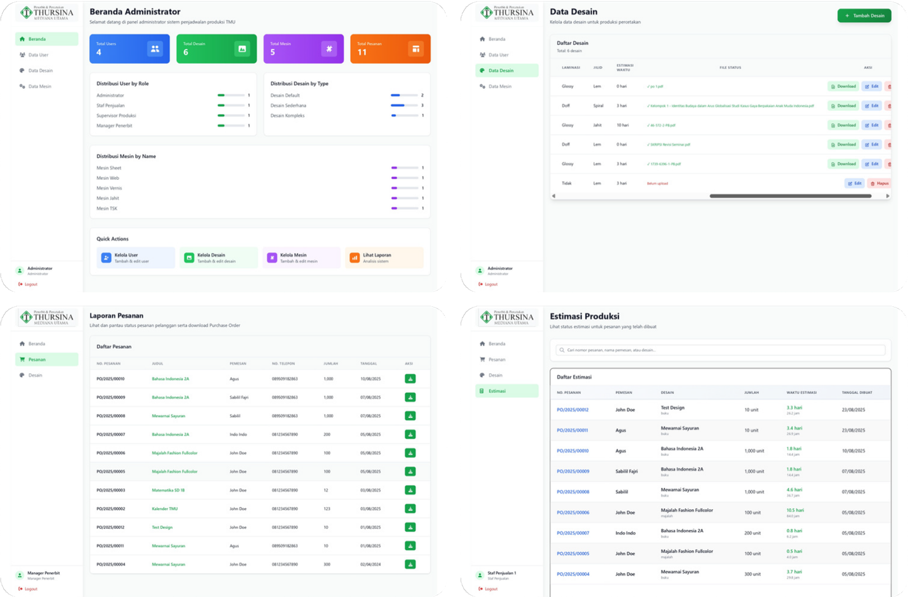 ⟫

### Proyek 3
- Judul: ⟪ ⟫
- Kategori: ⟪ ⟫
- Hasil: ⟪ ⟫
- Gambar: ⟪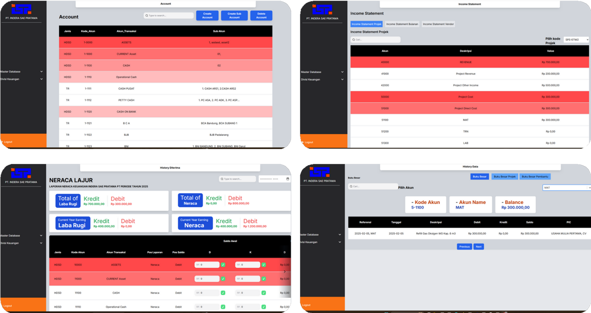 ⟫

### Proyek 4
- Judul: ⟪ ⟫
- Kategori: ⟪ ⟫
- Hasil: ⟪ ⟫
- Gambar: ⟪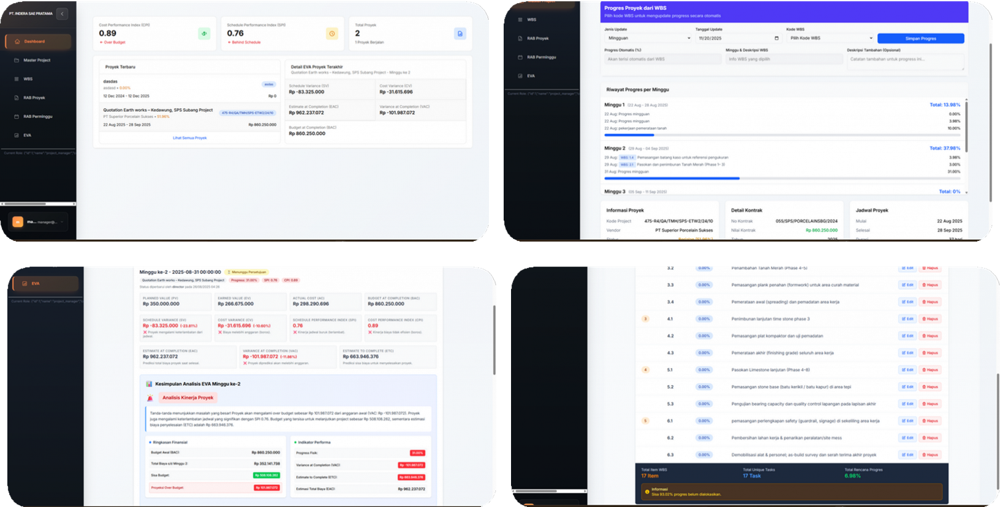 ⟫

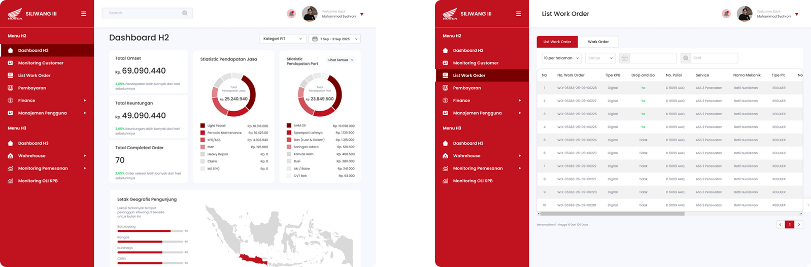

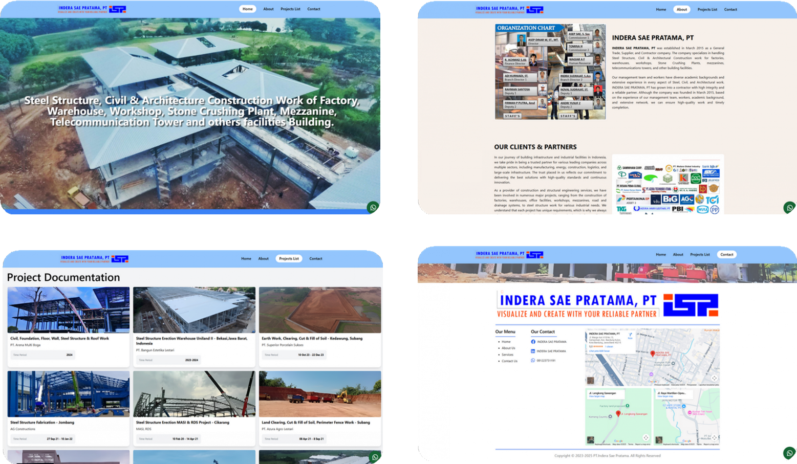

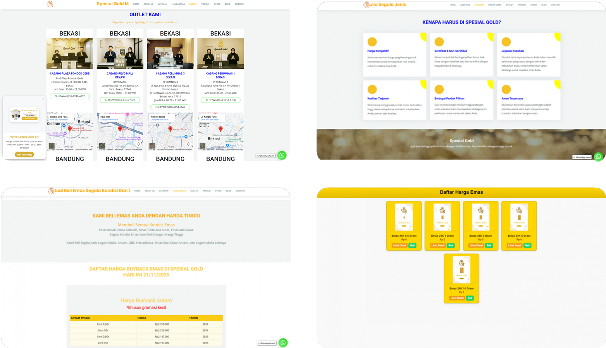

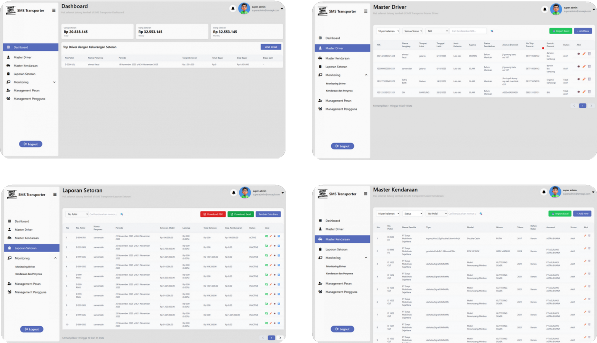

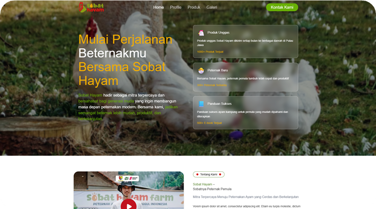

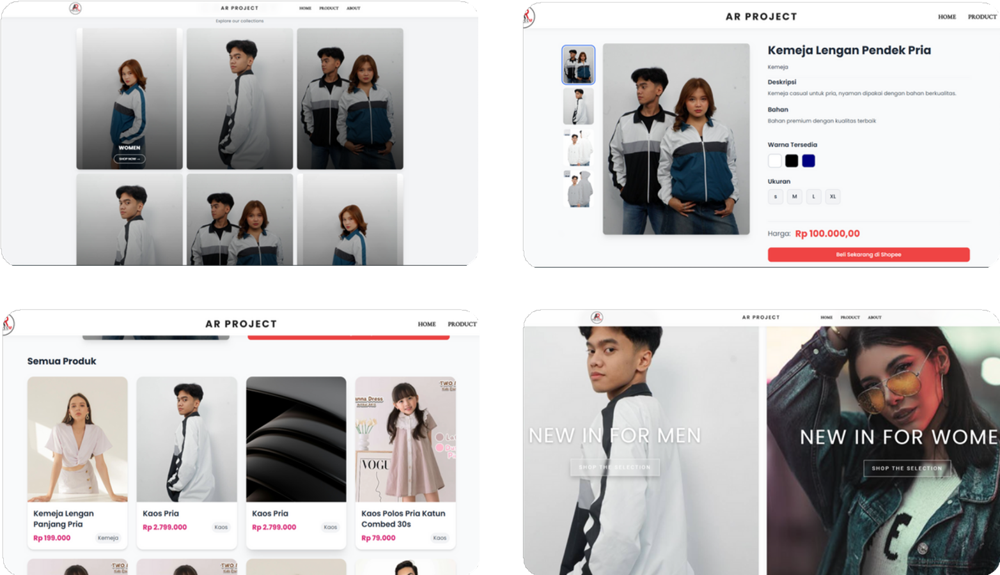

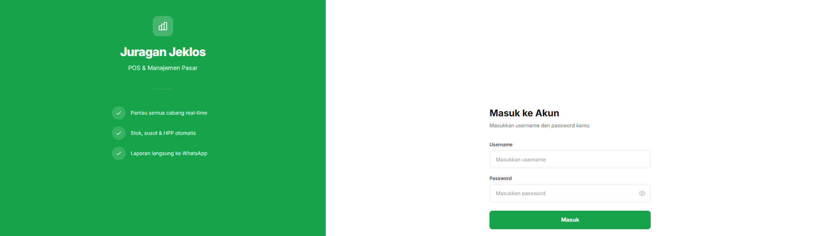

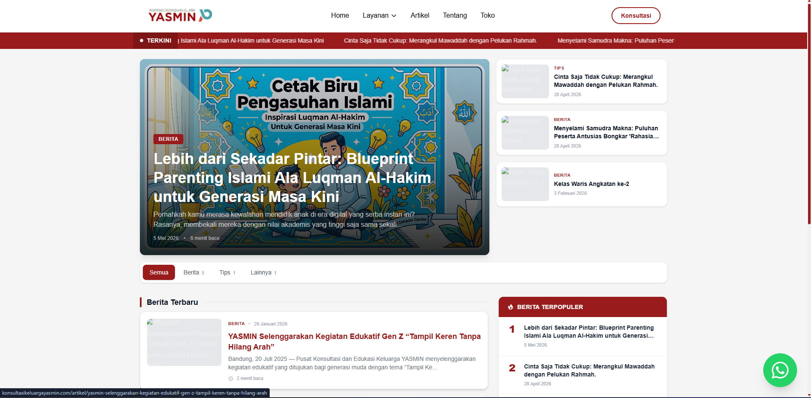

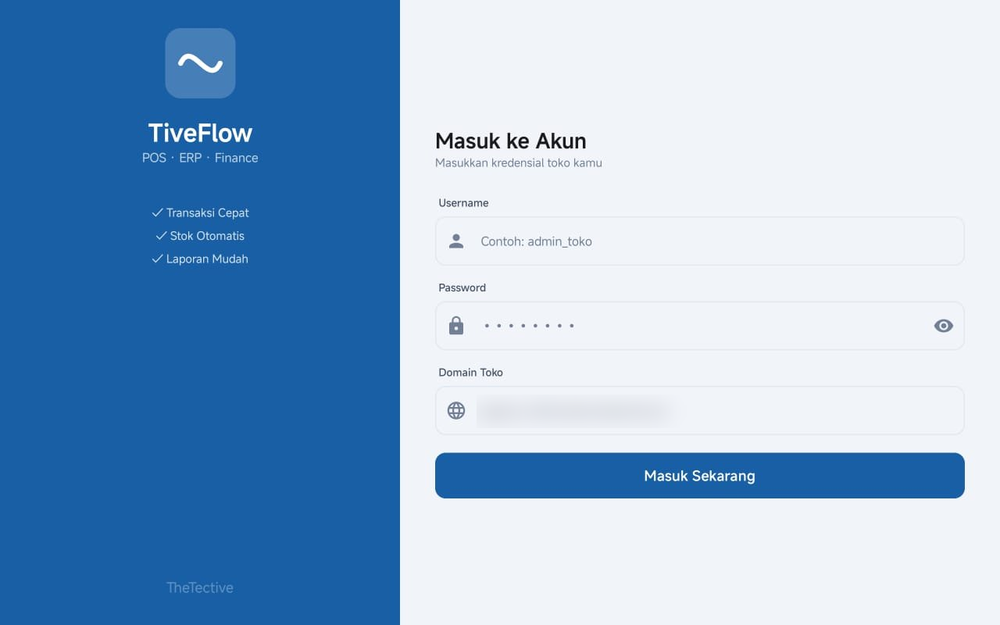

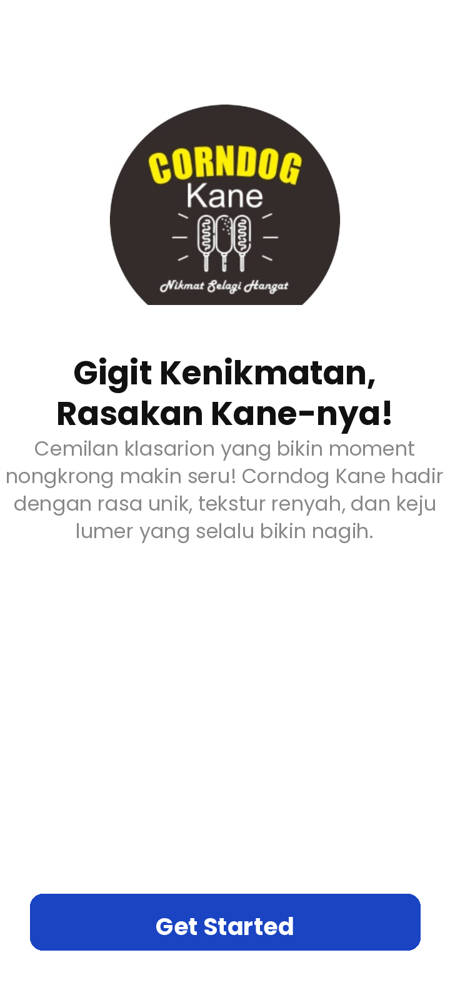
(salin blok di atas untuk proyek tambahan)

---

## 9. ABOUT (halaman /about)

### Hero About

- Badge: ⟪ ⟫
- Judul (boleh highlight 1 kata): ⟪ ⟫ (EN: ⟪ ⟫)
- Subjudul: ⟪ ⟫ (EN: ⟪ ⟫)
- Lokasi: ⟪ Bandung, Indonesia ⟫
- Gambar suasana/kantor: ⟪ about-office.jpg ⟫

### Story / Kisah
- Judul (boleh highlight): ⟪ ⟫ (EN: ⟪ ⟫)
- Paragraf 1: ⟪ ⟫
- Paragraf 2: ⟪ ⟫

### Principles / Prinsip (3 poin)
1. Judul: ⟪ ⟫ — Deskripsi: ⟪ ⟫
2. Judul: ⟪ ⟫ — Deskripsi: ⟪ ⟫
3. Judul: ⟪ ⟫ — Deskripsi: ⟪ ⟫

### Team / Tim (per orang)
1. Nama: ⟪ ⟫ — Jabatan: ⟪ ⟫ — Foto: ⟪ team-xxx.jpg ⟫
2. Nama: ⟪ ⟫ — Jabatan: ⟪ ⟫ — Foto: ⟪ ⟫
3. Nama: ⟪ ⟫ — Jabatan: ⟪ ⟫ — Foto: ⟪ ⟫
4. Nama: ⟪ ⟫ — Jabatan: ⟪ ⟫ — Foto: ⟪ ⟫

---

## 10. CONTACT / KONTAK (halaman /contact)

- Judul kartu: ⟪ Mulai proyek ⟫ (EN: ⟪ ⟫)
- Subjudul kartu: ⟪ ⟫ (EN: ⟪ ⟫)
- Label input email: ⟪ Email kerja Anda ⟫
- Placeholder: ⟪ anda@perusahaananda.com ⟫
- Teks tombol: ⟪ Pesan konsultasi 30 menit ⟫

---

## 11. FOOTER

- Tagline: ⟪ ⟫ (EN: ⟪ ⟫)
- Teks paling bawah (moto): ⟪ Kualitas, bukan kuantitas. ⟫

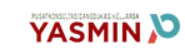

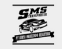

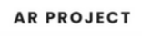
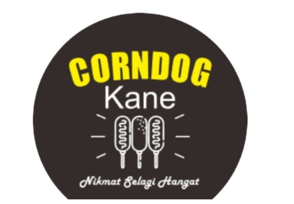
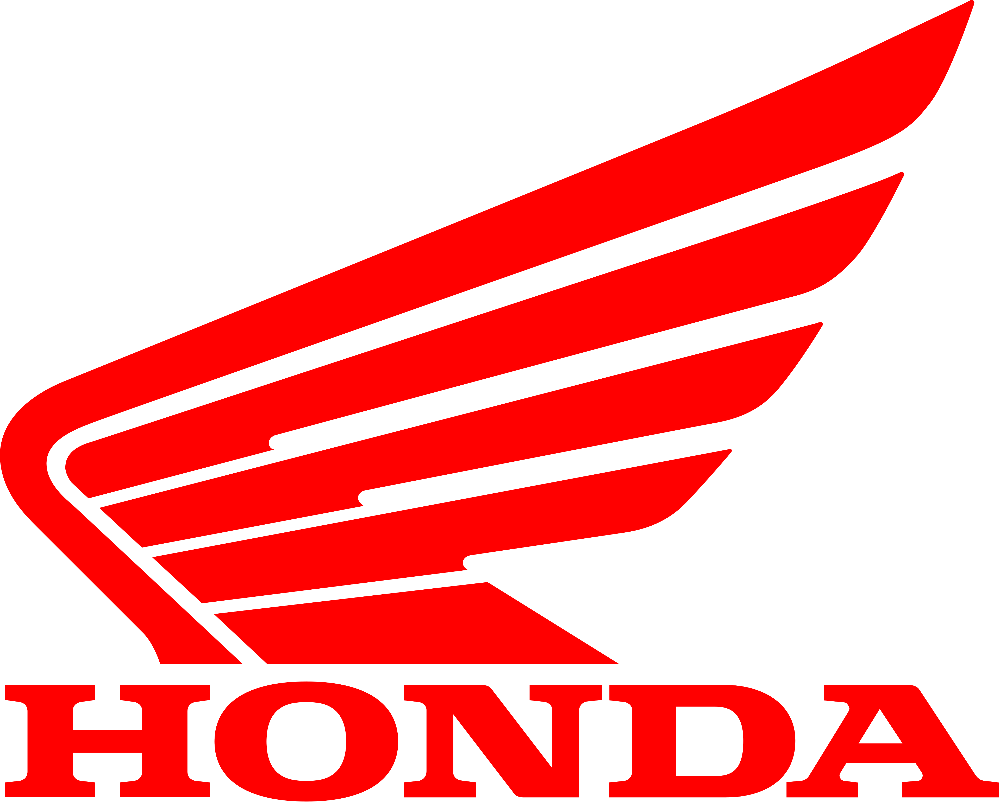
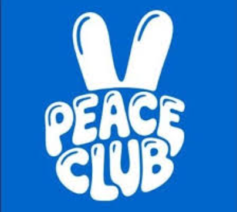
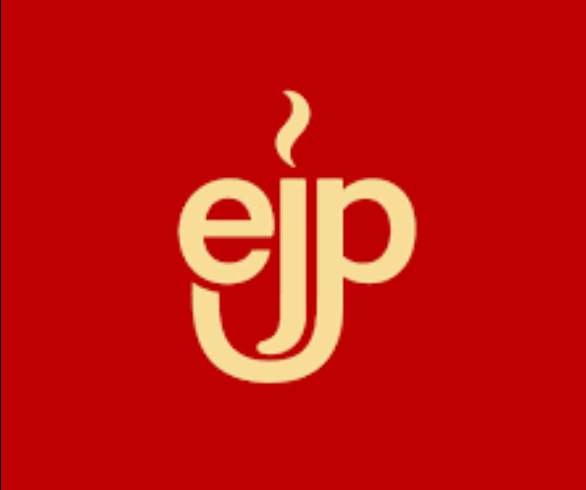
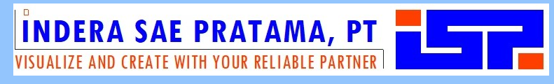